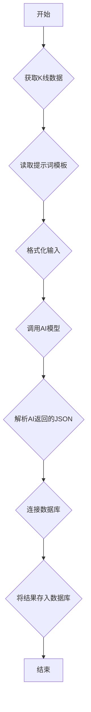

# AI 交易分析定时任务实施计划

本项目旨在创建一个定时任务，每小时获取 BTCUSDT 的K线数据，调用 AI 模型进行分析，并将结果存入 MySQL 数据库，最终通过一个简单的 Web 页面进行展示。

## 待办事项

- [ ] **1. 数据库设计与初始化**
- [ ] **2. 完善核心业务逻辑**
- [ ] **3. 实现定时任务调度器**
- [ ] **4. 创建 Web API 接口**
- [ ] **5. 创建前端展示页面**
- [ ] **6. 编写项目文档和部署说明**

---

## 1. 数据库设计与初始化

**目标**: 创建一个用于存储 AI 分析结果的 MySQL 表。

**表名**: `trade_analysis`

**字段设计**:

| 字段名 | 类型 | 描述 |
| :--- | :--- | :--- |
| `id` | `INT AUTO_INCREMENT PRIMARY KEY` | 主键 |
| `asset` | `VARCHAR(50)` | 交易对 (e.g., 'BTCUSDT') |
| `timestamp` | `DATETIME` | 分析时间 |
| `conclusion` | `VARCHAR(50)` | 交易结论 (e.g., 'OPEN_POSITION') |
| `direction` | `VARCHAR(10)` | 交易方向 (e.g., 'LONG', 'SHORT') |
| `confidence` | `FLOAT` | 置信度 (0.0 to 1.0) |
| `risk_reward_ratio` | `VARCHAR(20)` | 风险回报比 (e.g., '3.5:1') |
| `entry_point` | `DECIMAL(20, 8)` | 入场点位 |
| `stop_loss` | `DECIMAL(20, 8)` | 止损点位 |
| `take_profit_1` | `DECIMAL(20, 8)` | 止盈点位 1 |
| `take_profit_2` | `DECIMAL(20, 8)` | 止盈点位 2 (可为空) |
| `analysis_summary` | `TEXT` | 分析摘要 |
| `wave_analysis_4h` | `TEXT` | 4H 周期波浪分析 |
| `wave_analysis_1h` | `TEXT` | 1H 周期波浪分析 |
| `wave_analysis_15m` | `TEXT` | 15M 周期波浪分析 |
| `rationale` | `TEXT` | 详细理由 |
| `raw_response` | `JSON` | AI 返回的原始 JSON 数据 |

**实施步骤**:
1.  创建一个 `schema.sql` 文件，包含上述 `CREATE TABLE` 语句。
2.  修改 `db.py`，增加一个 `init_db()` 函数，该函数在程序启动时执行 `schema.sql` 来确保表存在。

---

## 2. 核心业务逻辑

**目标**: 整合数据获取、AI分析和数据存储三个环节，创建一个统一的业务流程函数。

**模块设计**:
-   创建一个新文件 `core/analysis_service.py`。
-   在该文件中定义一个异步函数 `run_analysis_task()`。

**流程图**:



**关键步骤**:
1.  调用 `get_kline_data.fetch_all_kline_data_concurrently('BTCUSDT')` 获取数据。
2.  读取 `prompts/analysis.txt` 的内容。
3.  将 K 线数据和提示词整合成一个完整的 prompt。
4.  调用 `openai_client.get_ai_response()` 发送给 AI。
5.  对返回的字符串进行 JSON 解析和验证。
6.  连接数据库，并将解析后的数据映射到 `trade_analysis` 表的字段，执行 `INSERT` 操作。

---

## 3. 实现定时任务调度器

**目标**: 每小时自动执行核心业务逻辑。

**技术选型**: `APScheduler` (一个流行的 Python 定时任务库)。

**实施步骤**:
1.  将 `APScheduler` 添加到 `requirements.txt`。
2.  创建一个新文件 `scheduler.py`。
3.  在 `scheduler.py` 中：
    -   实例化一个 `AsyncIOScheduler`。
    -   添加一个定时任务，配置为每小时 (`trigger='interval', hours=1`) 执行 `core.analysis_service.run_analysis_task`。
    -   提供 `start_scheduler()` 和 `shutdown_scheduler()` 函数。

---

## 4. 创建 Web API 接口

**目标**: 提供一个 HTTP 接口，用于查询最新的分析结果。

**技术选型**: `FastAPI` (已在 `requirements.txt` 中)。

**实施步骤**:
1.  创建一个新文件 `main.py` 作为 FastAPI 应用的入口。
2.  在 `main.py` 中：
    -   创建一个 FastAPI 实例。
    -   定义一个 GET 接口 `/analysis-history`，支持分页参数 (e.g., `?page=1&size=20`)。
    -   该接口的处理器将查询数据库，获取 `trade_analysis` 表中按 `timestamp` 降序排列的记录列表。
    -   返回包含分析列表和总页数信息的 JSON 对象。
    -   在应用启动时调用 `scheduler.start_scheduler()`，在应用关闭时调用 `scheduler.shutdown_scheduler()`。

---

## 5. 创建前端展示页面

**目标**: 创建一个简单的 HTML 页面来展示从 API 获取的数据。

**技术选型**: 原生 HTML, CSS, 和 JavaScript (无需复杂框架)。

**实施步骤**:
1.  创建一个 `static` 目录。
2.  在 `static` 目录下创建 `index.html`, `style.css`, `script.js`。
3.  `index.html`: 包含基本的页面骨架，用于展示分析结果的各个字段。
4.  `script.js`:
    -   在页面加载时，使用 `fetch` API 调用后端的 `/latest-analysis` 接口。
    -   获取到 JSON 数据后，动态地更新 `index.html` 中的内容。
    -   可以设置一个定时器，每分钟自动刷新一次数据。
5.  在 `main.py` 中配置 FastAPI 以提供静态文件服务。

---

## 6. 最终项目结构

```
/
├── .env
├── config.py
├── db.py
├── get_kline_data.py
├── openai_client.py
├── requirements.txt
├── main.py                 # FastAPI 应用入口
├── scheduler.py            # APScheduler 定时任务
├── core/
│   └── analysis_service.py # 核心业务逻辑
├── prompts/
│   └── analysis.txt
├── static/                 # 前端文件
│   ├── index.html
│   ├── style.css
│   └── script.js
└── docs/
    └── implementation_plan.md