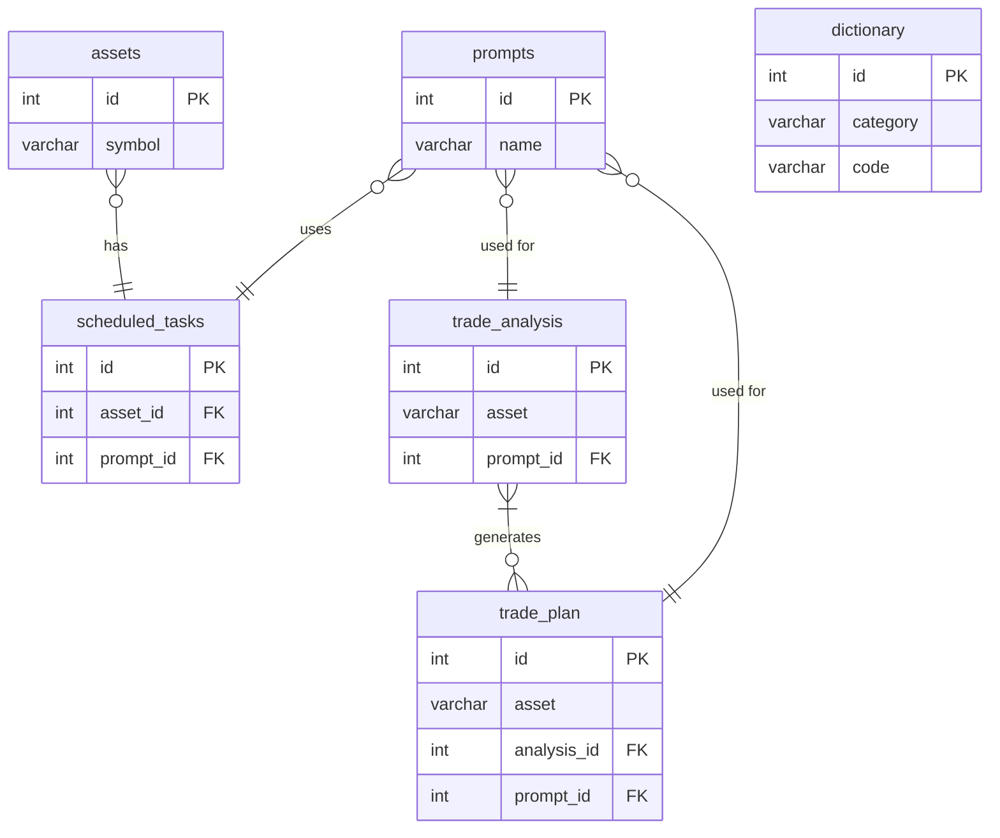

# 项目架构重构方案 (最终版)

## 1. 目标

本次重构旨在优化现有系统架构，以支持更复杂和灵活的交易分析策略。主要目标如下：

1.  **增强任务调度能力**：允许为单一资产配置多个不同周期、使用不同分析模型的定时任务。
2.  **引入交易计划为核心**：新增 `trade_plan` 表作为核心，存储结构化的、可执行的交易信号。
3.  **结构化分析结果**：重构 `trade_analysis` 表，使其包含关键的分析结果摘要，便于查询和展示。
4.  **提升可维护性**：新增 `dictionary` 表，用于统一管理系统中的常量和其中文名称的映射关系。

## 2. 数据库结构变更

### 2.1. `assets` 表 (资产配置表)
-   **变更**: 移除 `schedule_cron VARCHAR(100)` 字段。

### 2.2. `scheduled_tasks` 表 (定时任务表) - (新增)
```sql
CREATE TABLE scheduled_tasks (
    id INT AUTO_INCREMENT PRIMARY KEY COMMENT '任务ID',
    asset_id INT NOT NULL COMMENT '关联的资产ID',
    prompt_id INT NOT NULL COMMENT '关联的提示词ID',
    cycle ENUM('1m','5m','15m','1h','4h','1d') NOT NULL COMMENT '分析周期',
    cron_expression VARCHAR(100) NOT NULL COMMENT 'Cron表达式，定义执行周期',
    is_active BOOLEAN NOT NULL DEFAULT TRUE COMMENT '任务是否激活',
    created_at DATETIME DEFAULT CURRENT_TIMESTAMP COMMENT '创建时间',
    updated_at DATETIME DEFAULT CURRENT_TIMESTAMP ON UPDATE CURRENT_TIMESTAMP COMMENT '更新时间',
    FOREIGN KEY (asset_id) REFERENCES assets(id) ON DELETE CASCADE,
    FOREIGN KEY (prompt_id) REFERENCES prompts(id) ON DELETE CASCADE
) COMMENT='定时分析任务配置表';
```

### 2.3. `trade_analysis` 表 (行情分析结果表) - (重构)
```sql
CREATE TABLE trade_analysis (
    id INT AUTO_INCREMENT PRIMARY KEY COMMENT '记录ID',
    asset VARCHAR(50) NOT NULL COMMENT '资产符号 (币种)',
    timestamp DATETIME NOT NULL COMMENT '分析时间戳 (时间)',
    prompt_id INT NULL COMMENT '关联到prompts表的外键 (提示词)',
    cycle ENUM('1m','5m','15m','1h','4h','1d') NOT NULL COMMENT '分析周期 (周期)',
    trend VARCHAR(50) NULL COMMENT '趋势判断 (e.g., BULLISH, BEARISH, SIDEWAYS)',
    confidence FLOAT NULL COMMENT '置信度 (0.0 to 1.0)',
    conclusion VARCHAR(255) NULL COMMENT '一句话结论',
    extra_info JSON NULL COMMENT 'AI返回的原始响应或其他扩展字段 (扩展字段)',
    FOREIGN KEY (prompt_id) REFERENCES prompts(id) ON DELETE SET NULL,
    INDEX idx_asset_timestamp (asset, timestamp)
) COMMENT='AI行情分析结果表';
```

### 2.4. `trade_plan` 表 (交易计划表) - (新增)
```sql
CREATE TABLE trade_plan (
  id INT NOT NULL AUTO_INCREMENT COMMENT '交易计划ID',
  asset VARCHAR(50) NOT NULL COMMENT '交易资产，例如 BTCUSDT',
  cycle ENUM('1m','5m','15m','1h','4h','1d') NOT NULL COMMENT '对应分析周期',
  created_at DATETIME NOT NULL DEFAULT CURRENT_TIMESTAMP COMMENT '计划生成时间',
  direction ENUM('LONG','SHORT','NONE') NOT NULL COMMENT '交易方向。NONE 表示不交易',
  confidence FLOAT DEFAULT NULL COMMENT 'AI 置信度，0-1',
  entry_price DECIMAL(20,8) DEFAULT NULL COMMENT '入场价位',
  stop_loss DECIMAL(20,8) DEFAULT NULL COMMENT '止损价位',
  take_profit_1 DECIMAL(20,8) DEFAULT NULL COMMENT '第一止盈点',
  take_profit_2 DECIMAL(20,8) DEFAULT NULL COMMENT '第二止盈点',
  risk_reward_ratio VARCHAR(20) DEFAULT NULL COMMENT '风险回报比，例如 1:2.5',
  analysis_id INT DEFAULT NULL COMMENT '关联行情分析记录 trade_analysis.id',
  prompt_id INT DEFAULT NULL COMMENT '使用哪个提示词生成',
  extra_info JSON DEFAULT NULL COMMENT 'AI 的特殊字段、raw logic、reason 等原始内容',
  status ENUM('ACTIVE','EXECUTED','CANCELLED','EXPIRED') DEFAULT 'ACTIVE' COMMENT '计划状态',
  PRIMARY KEY (id),
  KEY idx_asset_time (asset, created_at),
  KEY idx_analysis_id (analysis_id),
  KEY idx_status (status),
  CONSTRAINT trade_plan_ibfk_1
    FOREIGN KEY (analysis_id) REFERENCES trade_analysis (id) ON DELETE SET NULL,
  CONSTRAINT trade_plan_ibfk_2
    FOREIGN KEY (prompt_id) REFERENCES prompts (id) ON DELETE SET NULL
) ENGINE=InnoDB DEFAULT CHARSET=utf8mb4 COMMENT='AI 生成的交易计划表';
```

### 2.5. `dictionary` 表 (字段常量映射表) - (新增)
```sql
CREATE TABLE dictionary (
    id INT AUTO_INCREMENT PRIMARY KEY,
    category VARCHAR(100) NOT NULL COMMENT '常量类别 (e.g., trade_plan_status, direction)',
    code VARCHAR(100) NOT NULL COMMENT '英文代码 (e.g., ACTIVE, LONG)',
    label VARCHAR(255) NOT NULL COMMENT '对应的中文标签 (e.g., 激活, 做多)',
    description TEXT NULL COMMENT '描述',
    UNIQUE KEY idx_category_code (category, code)
) COMMENT='用于前后端常量与中文名称映射的字典表';
```

## 3. 数据库关系图 (ERD)



## 4. 应用层代码影响

-   **`core/database.py`**: 需要更新或新增所有相关表的模型定义 (`Assets`, `ScheduledTask`, `TradeAnalysis`, `TradePlan`, `Dictionary`)。
-   **`services/analysis_service.py`**: 核心服务逻辑需要重写，以同时解析AI响应，并将数据分别填充到新的 `trade_analysis` 表（包含趋势、结论等）和 `trade_plan` 表。
-   **`core/scheduler.py`**: 调度逻辑需要重构，从 `scheduled_tasks` 表中读取任务配置。
-   **`api/` 目录**:
    -   为 `scheduled_tasks` 创建新的CRUD API。
    -   为 `trade_plan` 创建新的查询和修改API。
    -   为 `trade_analysis` 创建新的查询API。
    -   为 `dictionary` 创建新的只读API。
-   **前端**:
    -   应用加载时，调用API获取所有字典映射数据。
    -   创建新页面来展示 `trade_analysis` 和 `trade_plan` 的数据。
    -   在展示时，使用字典数据将英文代码转换为中文标签。

## 5. 下一步

1.  请确认这份**完整**的最终方案是否符合您的全部预期。
2.  如果确认，我们将以此为蓝图，切换到 `code` 模式开始实现。