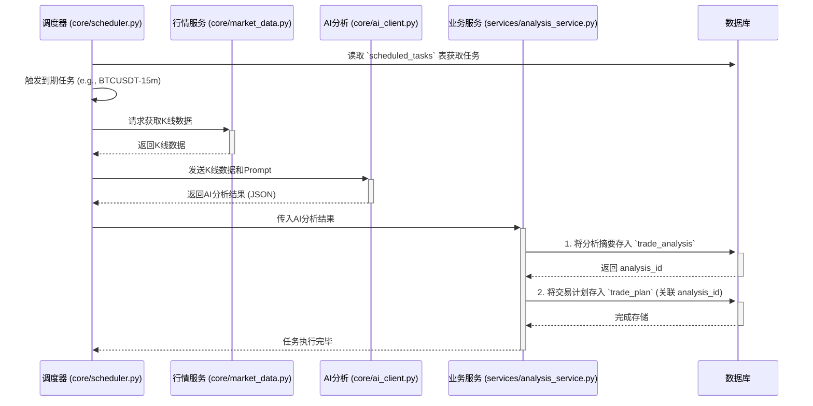
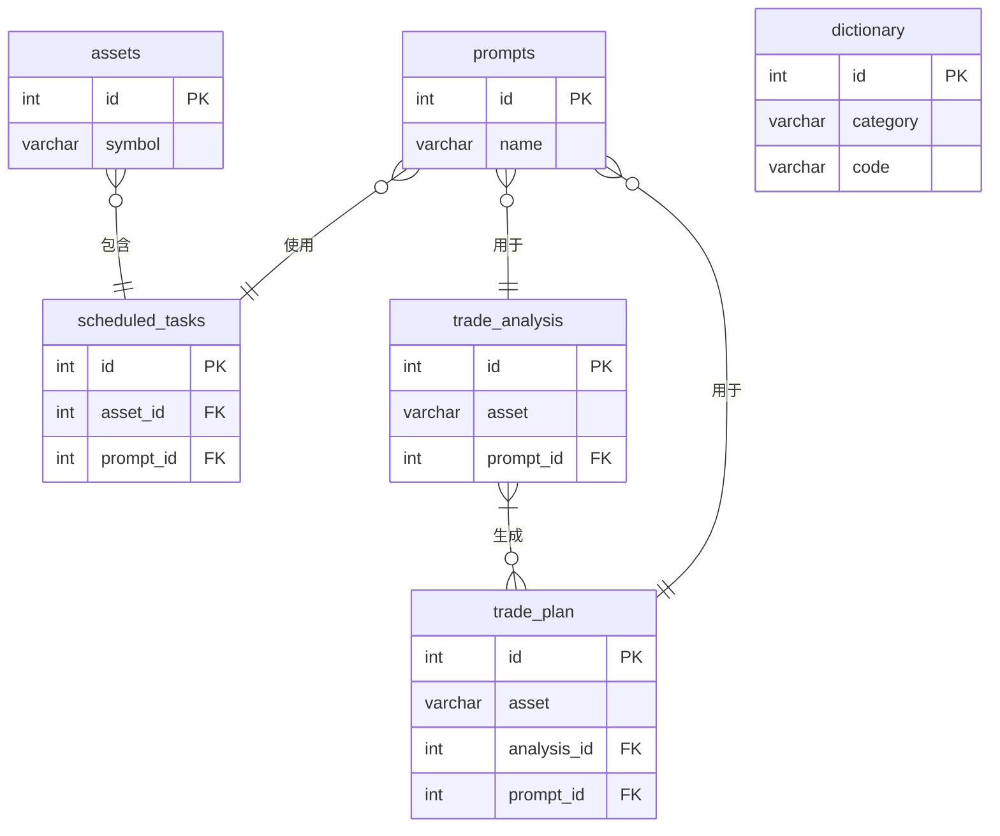

# AI 交易分析系统重构技术方案

**版本**: 1.0 (最终版)
**日期**: 2025-11-30

---

## 1. 概述

### 1.1. 背景与动机
当前系统在任务调度和数据结构方面存在局限性。每个资产只能配置一个定时任务，且所有分析结果都存储在一个庞大的表中，不利于扩展和查询。为了支持更复杂、多维度的交易策略，并提升系统的灵活性和可维护性，我们决定进行一次全面的架构重构。

### 1.2. 核心目标
1.  **增强任务调度**：实现单一资产可配置多个不同周期、不同分析模型的定时任务。
2.  **数据结构优化**：引入以“交易计划”为核心的数据模型，分离“分析结果”和“可执行计划”。
3.  **提升可维护性**：通过引入字典表，实现前后端常量解耦，便于国际化和界面维护。
4.  **增强用户体验**：提供清晰的界面来展示和管理人机协作生成的分析结果与交易计划。

---

## 2. 整体架构设计

### 2.1. 核心数据流
系统的数据流将遵循以下顺序，实现了从任务调度、数据获取、AI分析到结果存储的完整闭环。



### 2.2. 数据库 Schema 设计

#### 2.2.1. `assets` 表 (资产配置表) - (修改)
-   **变更**: 移除 `schedule_cron` 字段。
-   **用途**: 仅用于定义可供分析的基础资产列表。

#### 2.2.2. `scheduled_tasks` 表 (定时任务表) - (新增)
-   **用途**: 核心任务配置表，解耦资产与调度计划。
```sql
CREATE TABLE scheduled_tasks (
    id INT AUTO_INCREMENT PRIMARY KEY COMMENT '任务ID',
    asset_id INT NOT NULL COMMENT '关联的资产ID',
    prompt_id INT NOT NULL COMMENT '关联的提示词ID',
    cycle ENUM('1m','5m','15m','1h','4h','1d') NOT NULL COMMENT '分析周期',
    cron_expression VARCHAR(100) NOT NULL COMMENT 'Cron表达式',
    is_active BOOLEAN NOT NULL DEFAULT TRUE COMMENT '任务是否激活',
    FOREIGN KEY (asset_id) REFERENCES assets(id) ON DELETE CASCADE,
    FOREIGN KEY (prompt_id) REFERENCES prompts(id) ON DELETE CASCADE
) COMMENT='定时分析任务配置表';
```

#### 2.2.3. `trade_analysis` 表 (行情分析结果表) - (重构)
-   **用途**: 存储每次AI分析的**关键结果摘要**，用于快速浏览和筛选。
```sql
CREATE TABLE trade_analysis (
    id INT AUTO_INCREMENT PRIMARY KEY COMMENT '记录ID',
    asset VARCHAR(50) NOT NULL COMMENT '资产符号 (币种)',
    timestamp DATETIME NOT NULL COMMENT '分析时间戳 (时间)',
    prompt_id INT NULL COMMENT '关联的提示词 (提示词)',
    cycle ENUM('1m','5m','15m','1h','4h','1d') NOT NULL COMMENT '分析周期 (周期)',
    trend VARCHAR(50) NULL COMMENT '趋势判断',
    confidence FLOAT NULL COMMENT '置信度',
    conclusion VARCHAR(255) NULL COMMENT '一句话结论',
    extra_info JSON NULL COMMENT 'AI返回的原始响应 (扩展字段)',
    FOREIGN KEY (prompt_id) REFERENCES prompts(id) ON DELETE SET NULL
) COMMENT='AI行情分析结果表';
```

#### 2.2.4. `trade_plan` 表 (交易计划表) - (新增)
-   **用途**: 系统的核心产出，存储由AI分析生成的、结构化的、**可执行的交易计划**。
```sql
CREATE TABLE trade_plan (
  id INT NOT NULL AUTO_INCREMENT COMMENT '交易计划ID',
  asset VARCHAR(50) NOT NULL COMMENT '交易资产',
  cycle ENUM('1m','5m','15m','1h','4h','1d') NOT NULL COMMENT '对应分析周期',
  created_at DATETIME NOT NULL DEFAULT CURRENT_TIMESTAMP COMMENT '计划生成时间',
  direction ENUM('LONG','SHORT','NONE') NOT NULL COMMENT '交易方向',
  confidence FLOAT DEFAULT NULL COMMENT 'AI 置信度',
  entry_price DECIMAL(20,8) DEFAULT NULL COMMENT '入场价位',
  stop_loss DECIMAL(20,8) DEFAULT NULL COMMENT '止损价位',
  take_profit_1 DECIMAL(20,8) DEFAULT NULL COMMENT '第一止盈点',
  take_profit_2 DECIMAL(20,8) DEFAULT NULL COMMENT '第二止盈点',
  risk_reward_ratio VARCHAR(20) DEFAULT NULL COMMENT '风险回报比',
  analysis_id INT DEFAULT NULL COMMENT '关联行情分析记录',
  prompt_id INT DEFAULT NULL COMMENT '关联提示词',
  extra_info JSON DEFAULT NULL COMMENT 'AI 的理由、逻辑等原始内容',
  status ENUM('ACTIVE','EXECUTED','CANCELLED','EXPIRED') DEFAULT 'ACTIVE' COMMENT '计划状态',
  PRIMARY KEY (id),
  FOREIGN KEY (analysis_id) REFERENCES trade_analysis (id) ON DELETE SET NULL,
  FOREIGN KEY (prompt_id) REFERENCES prompts (id) ON DELETE SET NULL
) ENGINE=InnoDB DEFAULT CHARSET=utf8mb4 COMMENT='AI 生成的交易计划表';
```

#### 2.2.5. `dictionary` 表 (字段常量映射表) - (新增)
-   **用途**: 存储系统内所有枚举值和状态码的中英文映射，实现前后端解耦。
```sql
CREATE TABLE dictionary (
    id INT AUTO_INCREMENT PRIMARY KEY,
    category VARCHAR(100) NOT NULL COMMENT '常量类别 (e.g., trade_plan_status)',
    code VARCHAR(100) NOT NULL COMMENT '英文代码 (e.g., ACTIVE)',
    label VARCHAR(255) NOT NULL COMMENT '对应的中文标签 (e.g., 激活)',
    UNIQUE KEY idx_category_code (category, code)
) COMMENT='常量与中文名称映射的字典表';
```

### 2.3. 数据库关系图 (ERD)


---

## 3. 实施计划

### 3.1. 后端改造

#### 3.1.1. 核心模块 (`/core`)
-   **`database.py`**:
    -   移除 `Assets` 模型中的 `schedule_cron` 属性。
    -   重构 `TradeAnalysis` 模型以匹配新表结构。
    -   新增 `ScheduledTask`, `TradePlan`, `Dictionary` 三个 SQLAlchemy 模型。
-   **`scheduler.py`**:
    -   重写 `start` 或 `run` 方法。
    -   启动时，从数据库 `scheduled_tasks` 表加载所有 `is_active = TRUE` 的任务。
    -   为每个任务动态创建一个 APScheduler 作业。
    -   需要一个机制来处理任务的动态增、删、改（例如，定期重新加载任务）。

#### 3.1.2. 服务层 (`/services`)
-   **`analysis_service.py`**:
    -   重写 `save_analysis` 方法。
    -   该方法接收 AI 返回的 JSON 数据。
    -   **步骤1**: 解析 JSON，提取分析摘要（趋势、结论等），创建一个 `TradeAnalysis` 对象并存入数据库。
    -   **步骤2**: 解析 JSON，提取交易计划参数（方向、点位等），创建一个 `TradePlan` 对象，关联上一步的 `analysis_id`，然后存入数据库。

#### 3.1.3. API 层 (`/api`)
需要新增或修改以下 API 端点：

| 方法   | 路径                       | 描述                                   |
| :----- | :------------------------- | :------------------------------------- |
| `GET`  | `/api/tasks`               | 获取所有定时任务列表                   |
| `POST` | `/api/tasks`               | 新建一个定时任务                       |
| `PUT`  | `/api/tasks/{id}`          | 更新一个定时任务 (例如，修改周期或状态) |
| `DELETE`| `/api/tasks/{id}`          | 删除一个定时任务                       |
| `GET`  | `/api/analysis`            | 分页获取行情分析结果列表               |
| `GET`  | `/api/plans`               | 分页获取交易计划列表                   |
| `PUT`  | `/api/plans/{id}`          | 修改交易计划 (例如，更新状态)          |
| `GET`  | `/api/dictionary`          | 获取所有字典映射数据                   |

### 3.2. 前端改造 (`/static`)

#### 3.2.1. 数据管理
-   在应用启动时（例如 `main.js`），调用 `GET /api/dictionary` 接口，获取所有映射关系，并存储在全局状态或 Vuex/Pinia 中。

#### 3.2.2. 核心页面
1.  **任务管理页 (`manage.html`)**:
    -   改造此页面，用于展示 `scheduled_tasks` 列表。
    -   提供表单/弹窗用于创建和编辑任务。
2.  **行情分析页 (新增)**:
    -   创建一个新页面，调用 `GET /api/analysis`。
    -   以表格形式展示分析结果列表。
    -   表格列：币种, 时间, 周期, 趋势, 置信度, 结论。
    -   使用字典将 `trend` 等字段显示为中文。
3.  **交易计划页 (新增)**:
    -   创建一个新页面，调用 `GET /api/plans`。
    -   以卡片或表格形式展示交易计划列表。
    -   每个计划应清晰展示方向、入场点、止盈止损等。
    -   提供操作按钮，允许用户修改计划状态（例如，`ACTIVE` -> `CANCELLED`），调用 `PUT /api/plans/{id}` 接口。
    -   使用字典将 `direction`, `status` 等字段显示为中文。

### 3.3. 数据迁移与填充
-   **旧 `trade_analysis` 表**: 建议重命名为 `trade_analysis_archive` 进行归档，而不是进行复杂的数据迁移。
-   **`dictionary` 表**: 需要编写一个初始化脚本或在应用首次启动时，向该表插入基础数据。例如：
    ```sql
    INSERT INTO dictionary (category, code, label) VALUES
    ('trade_plan_status', 'ACTIVE', '激活'),
    ('trade_plan_status', 'CANCELLED', '已取消'),
    ('direction', 'LONG', '做多'),
    ('direction', 'SHORT', '做空');
    ```

---

## 4. 任务执行清单 (TODO List)

1.  **数据库迁移**: 更新 `schema.sql` 文件以匹配本方案的设计。
2.  **后端核心模块**: 修改 `core/database.py` 和 `core/scheduler.py`。
3.  **后端服务层**: 重构 `services/analysis_service.py`。
4.  **后端API层**: 实现所有新的 API 端点。
5.  **数据填充**: 编写 `dictionary` 表的初始数据填充逻辑。
6.  **前端开发**: 开发新的行情分析和交易计划页面，并改造任务管理页。
7.  **联调与测试**: 进行端到端的功能测试，确保数据流正确无误。
8.  **清理与部署**: 移除废弃代码，归档旧数据表，部署新版本。